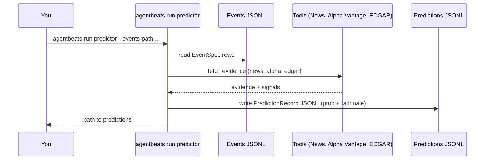
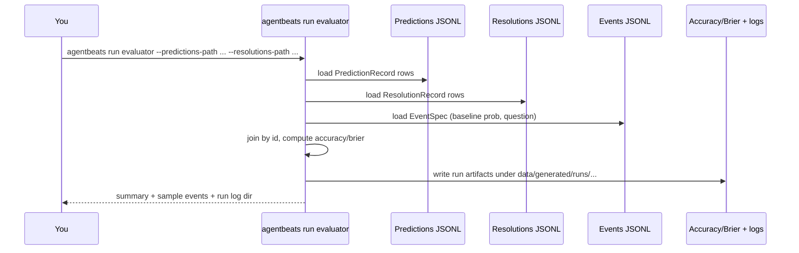

# AgentBeats Finance Track

Scaffolding for the FutureBench-Finance evaluator (green agent) and predictor (purple agent).

## Table of Contents

- [Getting Started](#getting-started)
- [CLI workflows](#cli-workflows)
- [Commands Table](#commands-table)
- [Workflows](#workflows)
- [Flows (sequence)](#flows-sequence)
- [API references](#api-references)
- [Glossary](#glossary)
- [Current Status](#current-status)

## Getting Started

1. Create a virtual environment and install dependencies:
   ```bash
   uv venv && source .venv/bin/activate
   pip install -e .
   ```
2. Run the CLI help:
   ```bash
   agentbeats --help
   ```

## CLI workflows

> Tips:
> - Set `ALPHAVANTAGE_API_KEY` to enable Alpha Vantage for price evidence/resolution.
> - Set `SEC_USER_AGENT` (e.g., `agentbeats/0.1 (contact: you@example.com)`) to enable EDGAR fetches.

| Command | Purpose | Key flags | Output |
| --- | --- | --- | --- |
| `agentbeats ingest events` | Snapshot events from Polymarket/fixtures | `--source`, `--limit`, `--include-active`, `--keywords`, `--output-path` | Events JSONL (`data/generated/events/latest.jsonl` by default) |
| `agentbeats run predictor` | Generate stub purple predictions | `--events-path`, `--output-path`, `--as-of` | Predictions JSONL (`data/generated/predictions/latest.jsonl`) |
| `agentbeats run evaluator` | Score predictions vs resolutions | `--predictions-path`, `--resolutions-path`, `--events-path` | Metrics summary + per-event details |
| `agentbeats run pipeline` | End-to-end ingest → predict → resolve-prices → evaluate | `--source`, `--limit`, `--as-of`, `--skip-ingest`, `--skip-resolve`, path overrides | Runs full pipeline, writes artifacts |
| `agentbeats resolve placeholders` | Create placeholder resolutions to edit | `--events-path`, `--output-path` | Resolutions JSONL (defaults to `data/generated/resolutions/latest.jsonl`) |
| `agentbeats resolve prices` | Resolve “close above $X on DATE” via Alpha Vantage | `--events-path`, `--output-path` | Resolutions JSONL with price outcomes |
| `agentbeats tool edgar` | Fetch EDGAR filings + XBRL facts for events | `--events-path`, `--output-path`, `--forms`, `--fact-tags`, `--limit` | EDGAR evidence JSONL (`data/generated/edgar/latest.jsonl`) |
| `agentbeats tool alpha-vantage` | Fetch Alpha Vantage time series (debug) | `symbol`, `--function`, `--output-path` | Raw Alpha Vantage JSON (also cached under `data/generated/tool_cache/alpha_vantage`) |
| `agentbeats status show` | Show available data files and counts | *(no flags)* | Lists events/predictions/resolutions/edgar paths + run logs |
| `agentbeats status coverage` | Check events vs resolutions coverage | `--events-path`, `--resolutions-path` | Counts missing/weak resolutions |

> Note: `resolve prices` is the Alpha Vantage–backed resolver for price-close events; `tool alpha-vantage` is a debug helper to inspect raw time series.

## Flows (sequence)

### Purple (predictor) flow


### Green (evaluator) flow


## Workflows

1. **Ingest events** (green)
   - `agentbeats ingest events --limit N --keywords "<tickers>"` for live Polymarket markets, or
   - `python scripts/generate_watchlist_events.py` then `--events-path data/generated/events/watchlist_latest.jsonl`.
2. **Fetch evidence / partial resolutions** (tools/resolvers)
   - `agentbeats tool edgar --events-path <events.jsonl> --output-path data/generated/edgar/latest.jsonl`
   - `agentbeats resolve prices --events-path <events.jsonl> --output-path data/generated/resolutions/latest.jsonl` (price-close pattern, requires `ALPHAVANTAGE_API_KEY`)
   - `agentbeats generate-resolutions` to create placeholders for manual edits.
3. **Generate predictions** (purple)
   - `agentbeats run predictor --events-path <events.jsonl> --as-of <ISO8601>`
4. **Provide/curate resolutions** (green)
   - Use fetched data + manual edits to produce `ResolutionRecord` JSONL.
5. **Evaluate** (green)
   - `agentbeats run evaluator --predictions-path <preds.jsonl> --resolutions-path <res.jsonl> --events-path <events.jsonl>`
   - Outputs Accuracy/Brier and stores run artifacts under `data/generated/runs/`.

## API references

- SEC EDGAR API (submissions, companyfacts): https://www.sec.gov/edgar/sec-api-documentation
- Alpha Vantage API (time series and functions): https://www.alphavantage.co/documentation/

## Glossary
- **EventSpec**: Canonical event/task packet (id, question, resolution_date, source, tags, baseline_probability).
- **PredictionRecord**: Purple agent output (probability + rationale/evidence + metadata) keyed by EventSpec.id.
- **ResolutionRecord**: Ground truth (outcome 0/1, optional verified value/source/timestamp) keyed by EventSpec.id.
- **Purple agent (predictor)**: Generates probabilities and rationales over EventSpec inputs.
- **Green agent (evaluator)**: Scores predictions against resolutions (Accuracy, Brier) and manages evidence/audit pipelines.
- **Tool adapters**: Shared external data fetchers (news, Alpha Vantage, EDGAR, Polymarket) used by predictors/resolvers.
- **Run artifacts**: Evaluation outputs stored under `data/generated/runs/<timestamp>/` (metrics, per-event records, inputs).

## Adding new CLI commands (workflow)
1. Add the command to the CLI (grouped under `ingest`, `run`, `resolve`, `tool`, or `status`).
2. Document the command in `README.md` (commands table, workflows/examples).
3. Include usage examples and required env vars in the command docstring/help so `--help` is informative.

See `docs/green-agent/plan.md` and `docs/purple-agent/responsibilities.md` for the roadmap and predictor contract, and `docs/tools/README.md` for shared tool interfaces.
