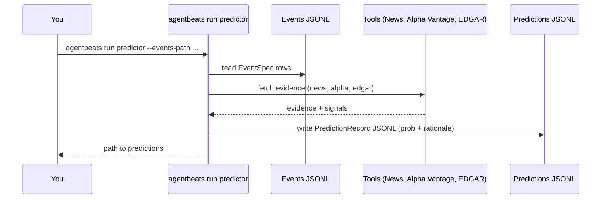
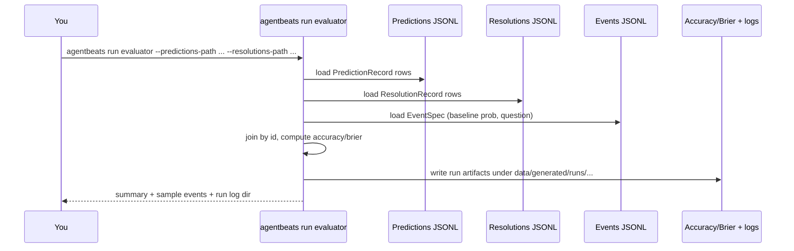

# PolyFutureBench

PolyFutureBench is a finance-focused forecasting and evaluation pipeline built for the AgentBeats competition. It targets developers and researchers who want to ingest real or fixture finance events, generate structured predictions, resolve outcomes, and score them with standard metrics (Accuracy/Brier). 

Out of the box, you get CLI-driven ingestion, a stub predictor with evidence hooks (news/Alpha Vantage/EDGAR), resolution helpers (placeholders and price-close), and a green evaluator that produces run artifacts for reproducibility. Use it to prototype finance prediction agents, validate prediction quality on JSONL datasets, and extend the tooling (LLM-based evidence validation, custom resolvers) for deeper audits and leaderboard-ready outputs.

## Table of Contents

- [Getting Started](#getting-started)
- [Quickstart](#quickstart)
- [CLI commands](#cli-commands)
  - [Ingesting events](#ingesting-events)
  - [Running predictor (purple)](#running-predictor-purple)
  - [Running evaluator (green)](#running-evaluator-green)
  - [Pipeline](#pipeline)
  - [Resolutions](#resolutions)
  - [Tools](#tools)
  - [Status](#status)
- [Flows (sequence)](#flows-sequence)
- [Glossary](#glossary)

## Getting Started

1. Create a virtual environment and install dependencies:
   ```bash
   uv venv && source .venv/bin/activate
   pip install -e .
   ```
2. Run the CLI help:
   ```bash
   agentbeats --help
   ```

## Quickstart

Minimal end-to-end run using fixtures (no API keys required):
```bash
agentbeats ingest events --source fixture
agentbeats run predictor
agentbeats resolve placeholders  # or skip if you already have resolutions
agentbeats run evaluator
```

For live data: set `ALPHAVANTAGE_API_KEY` (for price), `SEC_USER_AGENT` (for EDGAR), then use `agentbeats run pipeline --source polymarket`.

## CLI commands

Environment variables:
- `ALPHAVANTAGE_API_KEY` (required for price evidence/resolution).
- `SEC_USER_AGENT` (e.g., `agentbeats/0.1 (contact: you@example.com)`) required for EDGAR fetches.

### Ingesting events
Snapshot events from Polymarket or fixtures into a JSONL file (`data/generated/events/latest.jsonl`).

| Option | Description |
| --- | --- |
| `--source` | STRING: `polymarket` or `fixture` (default: polymarket) |
| `--limit` | INT: number of events to fetch (polymarket) |
| `--include-active/--no-include-active` | BOOL: include active markets (default: include) |
| `--keywords` | STRING: comma-separated filters (defaults to finance keywords) |
| `--output-path` | PATH: override output path |
Default keywords live in `src/agentbeats/domain/finance.py`. Defaults to `data/generated/events/latest.jsonl` if `--output-path` is omitted (falls back to fixtures with a warning if missing).

#### Use case 1: Polymarket snapshot
Fetch 10 events from Polymarket and write to `data/generated/events/latest.jsonl` (default).
```bash
agentbeats ingest events --source polymarket --limit 10
```

#### Use case 2: Offline fixture snapshot
Copy fixture events to `data/generated/events/latest.jsonl` (works offline).
```bash
agentbeats ingest events \
  --source fixture \
  --output-path data/generated/events/latest.jsonl
```

### Running predictor (purple)
Generate stub purple predictions and write them to JSONL (`data/generated/predictions/latest.jsonl`).

| Option | Description |
| --- | --- |
| `--events-path` | PATH: events JSONL (default: generated or fixtures) |
| `--output-path` | PATH: predictions JSONL output |
| `--as-of` | STRING: ISO8601 timestamp for metadata |

#### Use case 1: Default paths
Read default events (or fixture fallback) and write predictions to `data/generated/predictions/latest.jsonl`.
```bash
agentbeats run predictor
```

#### Use case 2: Explicit timestamp
Read events from the default path and stamp predictions with a fixed time.
```bash
agentbeats run predictor \
  --events-path data/generated/events/latest.jsonl \
  --as-of 2025-01-01T00:00:00Z
```

### Running evaluator (green)
Score predictions against resolutions (Accuracy/Brier) and write run artifacts.

| Option | Description |
| --- | --- |
| `--predictions-path` | PATH: predictions JSONL |
| `--resolutions-path` | PATH: resolutions JSONL |
| `--events-path` | PATH: events JSONL |

#### Use case 1: Default paths (falls back to fixtures)
Evaluate using defaults (or fixtures if missing); prints summary and writes run artifacts under `data/generated/runs/`.
```bash
agentbeats run evaluator
```

#### Use case 2: Explicit paths
Evaluate using explicit inputs.
```bash
agentbeats run evaluator \
  --predictions-path data/generated/predictions/latest.jsonl \
  --resolutions-path data/generated/resolutions/latest.jsonl \
  --events-path data/generated/events/latest.jsonl
```

### Pipeline
Run the end-to-end loop (ingest, predict, optionally resolve price-close events, then evaluate) with optional skips.

| Option | Description |
| --- | --- |
| `--source` | STRING: ingest source (polymarket or fixture) |
| `--limit` | INT: ingest limit (default: 10) |
| `--as-of` | STRING: prediction timestamp (ISO8601) |
| `--skip-ingest` / `--skip-resolve` | BOOL: skip steps if data already exists |
| `--events-path` | PATH: override events path (default: `data/generated/events/latest.jsonl`, falls back to fixtures if missing) |
| `--predictions-path` | PATH: override predictions output (default: `data/generated/predictions/latest.jsonl`) |
| `--resolutions-path` | PATH: override resolutions output (default: `data/generated/resolutions/latest.jsonl`) |
Default source: `fixture`; default limit: `10`; skips default to false.

#### Use case 1: Full pipeline with fixtures
Ingest fixture events, predict, try price resolutions (if key set), then evaluate.
```bash
agentbeats run pipeline \
  --source fixture \
  --limit 5
```

#### Use case 2: Reuse existing events, skip resolution
Skip ingest and resolution, reuse existing events/resolutions, run predict + evaluate.
```bash
agentbeats run pipeline \
  --skip-ingest \
  --skip-resolve \
  --events-path data/generated/events/latest.jsonl
```

### Resolutions
Create placeholder resolutions or resolve price-close events via Alpha Vantage (`data/generated/resolutions/latest.jsonl`).

| Command | Notes |
| --- | --- |
| `agentbeats resolve placeholders` | Writes editable ResolutionRecord JSONL (defaults to `data/generated/resolutions/latest.jsonl`) |
| `agentbeats resolve prices` | Requires `ALPHAVANTAGE_API_KEY`; resolves “close above $X on DATE” by filling ResolutionRecord JSONL (defaults to generated resolutions path) |

#### Use case 1: Generate editable placeholders
Create a resolutions file with outcome=0 stubs to fill manually.
```bash
agentbeats resolve placeholders \
  --events-path data/generated/events/latest.jsonl \
  --output-path data/generated/resolutions/latest.jsonl
```

#### Use case 2: Resolve price-close events
Fill resolutions for questions like “close above $X on DATE” using Alpha Vantage; writes outcomes/values.
```bash
agentbeats resolve prices \
  --events-path data/generated/events/latest.jsonl \
  --output-path data/generated/resolutions/latest.jsonl
```

### Tools
Available tools:

| Command | Notes |
| --- | --- |
| `agentbeats tool edgar` | Set `SEC_USER_AGENT`; writes EDGAR JSONL (`data/generated/edgar/latest.jsonl`); default forms: 8-K/10-Q/10-K; default fact tags: EPS diluted, revenues; default limit: 1. (SEC docs: https://www.sec.gov/edgar/sec-api-documentation) |
| `agentbeats tool alpha-vantage` | Set `ALPHAVANTAGE_API_KEY`; fetches raw time series (cached); default function: `TIME_SERIES_DAILY`. (Docs: https://www.alphavantage.co/documentation/) |

Use case: Fetch EDGAR filings/facts
```bash
agentbeats tool edgar \
  --events-path data/generated/events/latest.jsonl \
  --output-path data/generated/edgar/latest.jsonl
```

Use case: Debug Alpha Vantage time series
```bash
agentbeats tool alpha-vantage TSLA \
  --function TIME_SERIES_DAILY \
  --output-path data/generated/tool_cache/alpha_vantage/tsla_daily.json
```

### Status
Check data availability and coverage.

| Command | Notes |
| --- | --- |
| `agentbeats status show` | Lists events/predictions/resolutions/edgar paths + run logs |
| `agentbeats status coverage` | Flags missing resolutions or missing provenance/timestamps |

#### Use case 1: Show data files
Lists line counts, mtimes, and run log count.
```bash
agentbeats status show
```

#### Use case 2: Coverage check
Counts missing/provenance issues for resolutions.
```bash
agentbeats status coverage \
  --events-path data/generated/events/latest.jsonl \
  --resolutions-path data/generated/resolutions/latest.jsonl
```

## Flows (sequence)

### Purple (predictor) flow
Predictor flow (purple): CLI reads events, gathers evidence with tools, and writes predictions JSONL for the evaluator.

Step-by-step:
- Dev runs `agentbeats run predictor --events-path ...`.
- CLI loads `EventSpec` rows from events JSONL (defaults/fixtures if not provided).
- CLI calls tools (news, Alpha Vantage, EDGAR) to gather evidence/signals.
- Tools return evidence items; CLI builds `PredictionRecord` with probability + rationale.
- CLI writes predictions to JSONL (`data/generated/predictions/latest.jsonl` by default).
- CLI returns path to predictions for downstream evaluation.


### Green (evaluator) flow
Evaluator flow (green): CLI loads predictions, resolutions, and events, computes Accuracy/Brier, and stores run artifacts.

Step-by-step:
- Dev runs `agentbeats run evaluator --predictions-path ... --resolutions-path ... --events-path ...`.
- CLI loads `PredictionRecord` JSONL, `ResolutionRecord` JSONL, and `EventSpec` (for baseline probabilities/questions).
- CLI joins by `id`, computes Accuracy and Brier, and builds per-event explanations.
- CLI writes run artifacts under `data/generated/runs/<timestamp>/` (metrics, records, inputs).
- CLI prints a summary and sample events, returning the run log directory.


## Glossary
- **EventSpec**: Canonical event/task packet (id, question, resolution_date, source, tags, baseline_probability).
- **PredictionRecord**: Purple agent output (probability + rationale/evidence + metadata) keyed by EventSpec.id.
- **ResolutionRecord**: Ground truth (outcome 0/1, optional verified value/source/timestamp) keyed by EventSpec.id.
- **Purple agent (predictor)**: Generates probabilities and rationales over EventSpec inputs.
- **Green agent (evaluator)**: Scores predictions against resolutions (Accuracy, Brier) and manages evidence/audit pipelines.
- **Tool adapters**: Shared external data fetchers (news, Alpha Vantage, EDGAR, Polymarket) used by predictors/resolvers.
- **Run artifacts**: Evaluation outputs stored under `data/generated/runs/<timestamp>/` (metrics, per-event records, inputs).

See `docs/green-agent/plan.md` and `docs/purple-agent/responsibilities.md` for the roadmap and predictor contract, and `docs/tools/README.md` for shared tool interfaces.
